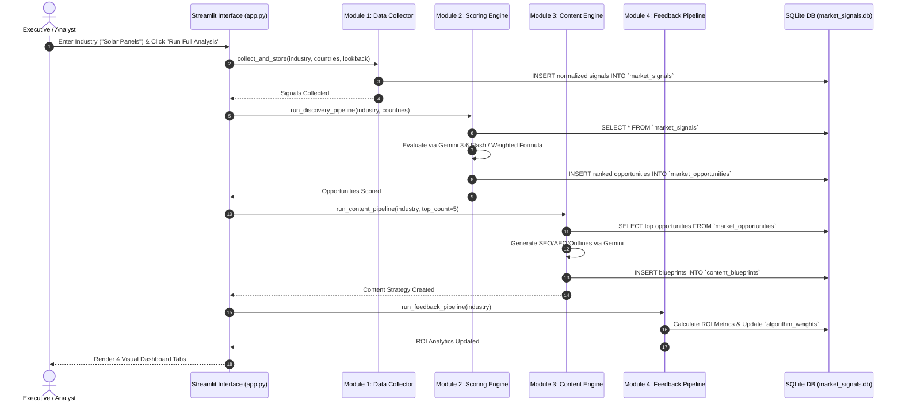

# B2B Market Intelligence & Executive Strategy Engine
## Complete Technical Architecture & Module Specifications

**Author**: Sai Varun  
**Target Audience**: Susheel Kumar Patil, Technical Leadership & Assessment Review Team  
**System Version**: 1.0.0 (Production / Streamlit Cloud Ready)  

---

## Executive Summary

The **B2B Market Intelligence & Executive Strategy Engine** is an end-to-end autonomous market discovery, opportunity scoring, executive content generation, and closed-loop business feedback system. 

It solves the core commercial challenge faced by B2B research agencies and enterprise marketing leaders: **identifying high-intent, rapidly growing market demand before competitors, structuring hyper-targeted executive strategy reports, and continuously refining scoring algorithms based on real-world ROI performance.**

```
┌──────────────────────────────────────────────────────────────────────────────────────────────────┐
│                                SYSTEM ARCHITECTURE & DATA FLOW                                   │
└──────────────────────────────────────────────────────────────────────────────────────────────────┘

 [Live Data Sources]           [Module 1: Signal Collector]           [Module 2: Opportunity Engine]
 (NewsData, NewsAPI, ───► Ingests & Normalizes Market Signals ───► Evaluates Signal Intensity & Scores
  RSS, Google Trends)        into SQLite `market_signals`           Opportunities with Gemini 3.6/3.7
                                                                                   │
                                                                                   ▼
 [Module 4: Business ROI Feedback]     [Module 3: Content Engine]         `market_opportunities`
  Tracks Leads, Sales, ROI &      ◄─── Generates C-suite Blueprints ◄─── (Scored & Ranked Opportunities)
  Adapts Weights (`algorithm_weights`)   (SEO, AEO, Outlines, CTAs)
```

---

## 1. Module Specifications & Technical Logic

### Module 1: Live Market Signal Collector (`module1_data_collector.py`)

#### Purpose
Collects real-time market intent, regulatory policy updates, M&A investments, R&D patent filings, and search momentum signals across key global markets (USA, Japan, South Korea, Germany, France, UK).

#### Key Logic & Architecture
- **Multi-Source Ingestion**: Queries `NewsData.io` API, `NewsAPI.org`, curated RSS feeds (`feedparser`), and `PyTrends` (Google Trends API).
- **Signal Normalization**: Maps raw news articles and search trends into standardized `MarketSignal` objects categorized into 6 core signal types:
  1. `REGULATORY`: Policy mandates, tariffs, subsidy changes.
  2. `PRODUCT_LAUNCH`: Enterprise technology releases and product rollouts.
  3. `INVESTMENT_MNA`: Venture capital, private equity, and merger activity.
  4. `PATENT_RD`: R&D breakthroughs and intellectual property filings.
  5. `CAPACITY_EXPANSION`: Factory builds and supply chain expansions.
  6. `SEARCH_MOMENTUM`: Google search volume index (0-100).
- **Resilient Fallback**: Implements deterministic mock signal generators to guarantee pipeline continuity if live news API limits are exhausted or API keys are absent.
- **Database Schema (`market_signals`)**:
  ```sql
  CREATE TABLE market_signals (
      signal_id TEXT PRIMARY KEY,
      industry TEXT NOT NULL,
      country TEXT NOT NULL,
      signal_type TEXT NOT NULL,
      title TEXT NOT NULL,
      description TEXT,
      source TEXT,
      date TEXT NOT NULL,
      quantitative_metric REAL,
      created_at TEXT NOT NULL
  );
  ```

---

### Module 2: Market Opportunity Scoring Engine (`module2_scoring_engine.py`)

#### Purpose
Synthesizes ingested raw market signals into ranked, high-value commercial market opportunities scored from 0 to 100, providing an executive "Why-Now" commercial rationale for C-suite decision-makers.

#### Key Logic & Mathematical Model
- **AI Scoring Engine**: Sends structured signal data to **Gemini 3.6 / 3.7 Flash** (`google-genai` SDK) using a system prompt demanding JSON output containing `opportunity_score`, `why_now_rationale`, `commercial_intent`, and `recommended_report_title`.
- **Deterministic Algorithmic Fallback**: When Gemini API is offline or rate-limited, computes opportunity scores using weighted multi-signal aggregation:
  $$\text{Opportunity Score} = \sum_{k \in \text{SignalTypes}} (w_k \cdot \bar{S}_k) \times \text{Boost}_{\text{country}}$$
  where:
  - $w_k$ = Algorithm weights assigned to signal category $k$ (e.g. Regulatory = 0.25, M&A = 0.20, R&D = 0.15, Capacity = 0.15, Search = 0.15, Product = 0.10).
  - $\bar{S}_k$ = Average quantitative signal intensity metric for category $k$.
  - $\text{Boost}_{\text{country}}$ = Geographic commercial market multiplier (e.g. USA = 1.15x, Germany = 1.10x, Japan = 1.05x).
- **Database Schema (`market_opportunities`)**:
  ```sql
  CREATE TABLE market_opportunities (
      opportunity_id TEXT PRIMARY KEY,
      industry TEXT NOT NULL,
      keyword TEXT NOT NULL,
      target_country TEXT NOT NULL,
      opportunity_score REAL NOT NULL,
      why_now_rationale TEXT NOT NULL,
      commercial_intent TEXT NOT NULL,
      recommended_report_title TEXT NOT NULL,
      created_at TEXT NOT NULL
  );
  ```

---

### Module 3: Executive Content Strategy Engine (`module3_content_engine.py`)

#### Purpose
Transforms top-ranked market opportunities into publication-ready executive content blueprints designed to capture decision-maker search intent and position the agency as a market authority.

#### Key Logic & Deliverables
Each blueprint generated by Gemini 3.6 / 3.7 Flash (or rule-based fallback) consists of 5 strategic layers:
1. **Search Engine Positioning (SEO)**: Target meta descriptions, primary/secondary keywords, optimized URL slug.
2. **AI Answer Engine & Zero-Click Positioning (AEO/GEO)**: Direct executive answer snippets optimized for Perplexity, ChatGPT, and Google AI Overviews, entity tags, and citable facts.
3. **C-Suite Executive Outline**: Multi-section report outline with section headers, executive summaries, and bulleted key takeaways.
4. **Executive Q&A FAQs**: Frequently asked strategic questions with concise, authoritative answers.
5. **High-Intent CTA**: Lead generation headlines, button labels, and conversion hooks (e.g., "Download 2026 Executive Procurement Matrix").
- **Database Schema (`content_blueprints`)**:
  ```sql
  CREATE TABLE content_blueprints (
      blueprint_id TEXT PRIMARY KEY,
      opportunity_id TEXT NOT NULL,
      industry TEXT NOT NULL,
      keyword TEXT NOT NULL,
      target_country TEXT NOT NULL,
      proposed_title TEXT NOT NULL,
      executive_target_audience TEXT NOT NULL,
      seo_strategy TEXT NOT NULL,
      aeo_geo_strategy TEXT NOT NULL,
      content_outline TEXT NOT NULL,
      faq_structures TEXT NOT NULL,
      call_to_action TEXT NOT NULL,
      created_at TEXT NOT NULL
  );
  ```

---

### Module 4: Closed-Loop Business ROI & Performance Analytics (`module4_feedback_engine.py`)

#### Purpose
Closes the loop between market discovery and commercial business outcomes. Tracks lead generation and report sales revenue, and **dynamically adjusts Module 2 scoring weights based on historical performance**.

#### Key Logic & Self-Optimization Algorithm
- **ROI Analytics Tracking**: Ingests traffic metrics (`organic_traffic`, `qualified_b2b_leads`, `report_sales_revenue`, `conversion_rate`) for published blueprints and calculates a normalized Business ROI score (0–100).
- **Adaptive Weight Adjustment**:
  - Compares initial opportunity score predictions against actual commercial conversion performance.
  - If regulatory-driven opportunities generate 30% higher ROI than expected, the system automatically increases $w_{\text{regulatory}}$ in the `algorithm_weights` table.
  - Ensures the platform learns over time, prioritizing market signals that produce maximum revenue.
- **Database Schema (`feedback_analytics` & `algorithm_weights`)**:
  ```sql
  CREATE TABLE feedback_analytics (
      feedback_id TEXT PRIMARY KEY,
      opportunity_id TEXT NOT NULL,
      keyword TEXT NOT NULL,
      target_country TEXT NOT NULL,
      initial_opportunity_score REAL NOT NULL,
      organic_traffic INTEGER NOT NULL,
      qualified_b2b_leads INTEGER NOT NULL,
      report_sales_revenue REAL NOT NULL,
      conversion_rate REAL NOT NULL,
      roi_score REAL NOT NULL,
      created_at TEXT NOT NULL
  );

  CREATE TABLE algorithm_weights (
      version INTEGER PRIMARY KEY,
      signal_weights TEXT NOT NULL,
      country_boost_factors TEXT NOT NULL,
      updated_at TEXT NOT NULL
  );
  ```

---

### Executive Visual Interface (`app.py`)

#### Purpose
Provides an interactive dashboard built with **Streamlit** for C-suite executives and analysts to inspect signals, discover opportunities, inspect content strategies, and evaluate ROI performance.

#### Interface Tabs
1. **📡 Market Signals**: Interactive metric cards (Total Signals, Active Markets, Intensity), volume bar charts by country and signal category, and detailed dataframes.
2. **⚡ Opportunity Matrix**: Ranked opportunity leaderboard, expandable "Why-Now" rationale cards, and intent classifications.
3. **📝 Executive Content Strategy**: Inspector dropdown allowing users to examine full SEO specs, AEO zero-click snippets, executive outlines, FAQs, and lead gen CTAs for any discovered opportunity.
4. **📊 Business ROI & Performance**: High-level revenue cards ($ revenue, leads, ROI score), performance tables, and live adaptive scoring weight matrices.
5. **⚙️ Interactive Controls**: Target industry text box ("Solar Panels", "Electric Vehicles"), country multi-select, lookback slider, step-by-step pipeline execution buttons, and one-click **🚀 Run Full Market Analysis**.

---

## 2. Module Interactions & Workflow Diagram



---

## 3. Production Deployment Architecture

- **Hosting Platform**: Streamlit Community Cloud (with Docker & Render fallback support via included `Dockerfile` and `Procfile`).
- **Zero-Config Database**: Embedded SQLite database (`market_signals.db`) with automatic schema initialization (`ensure_database_initialized()`) on first cloud startup.
- **Secrets Management**: Secrets bridge (`sync_streamlit_secrets()`) automatically forwards Streamlit Cloud secrets to standard environment variables.
